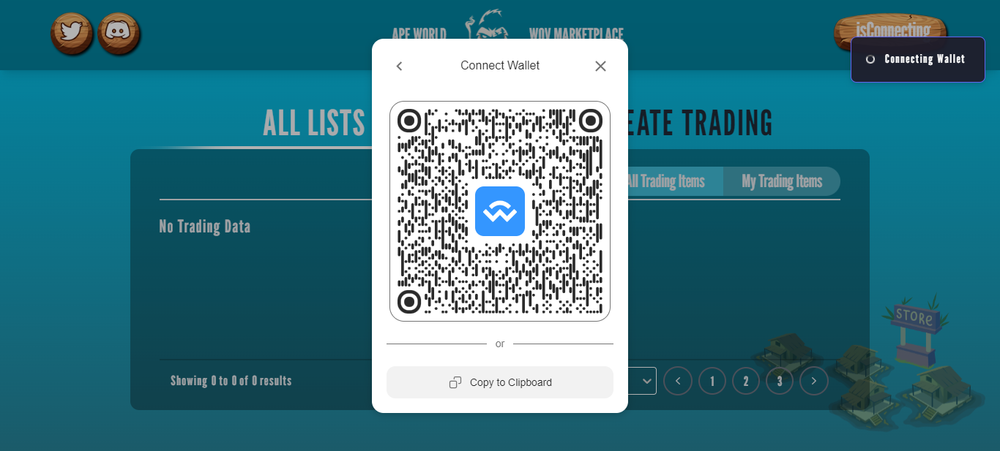
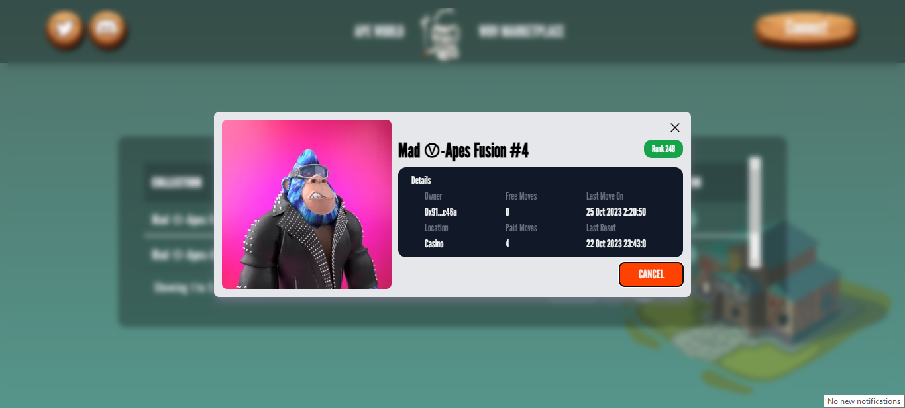

# ape-world-wov-marketplace

**Web3** World of Apes Runs WOV Marketplace - built with `React`


## Getting Started

```yaml
node.js: ^18.17.0
yarn: 1.22.22
```

```bash
# install dependencies
npm install
# or
yarn install

# serve with hot reload at localhost:3000
npm start
# or
yarn start
```

## Important TIPs

> We use calls toward [https://mainnet.api.worldofv.art/graphql](https://mainnet.api.worldofv.art/graphql) for Apollo Client GraphQL query.
>
> But it's only allowed to access from [http://localhost:3000](http://localhost:3000), or you'll get a **CORS** error.
>
> **API** is provided via :
> https://mainnet.veblocks.net/doc/swagger-ui/

## Visit Marketplace App

http://localhost:3000/

## Screenshots






&copy; 2022 - 2024 @devmaster518

All Rights Reserved.
